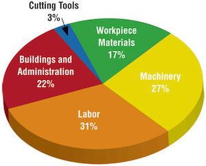

```{r}
#| include: false
#| cache: false
source("../_colors.R")
```


::: {.chapterintro}
This chapter focuses on **categorical data** — variables whose values are categories or labels rather than numbers. We begin with visualizations for a single categorical variable (bar charts, pie charts, waffle charts), then move to tools for exploring the relationship between two categorical variables (contingency tables and stacked bar charts). We close with principles for creating effective, honest data visualizations.
:::


## Visualizing one categorical variable {#sec-viz-categorical}

### Bar charts

A **bar chart** is the most common way to display the distribution of a single categorical variable. Each category gets its own bar, and the height (or length) of the bar represents either the count or the proportion of observations in that category.

Consider a dataset of 10,000 loans from a lending platform. Each borrower's homeownership status is recorded as `rent`, `mortgage`, or `own`. The frequency table below summarizes the data:

| Homeownership | Count |
|:--------------|------:|
| Rent          | 3,858 |
| Mortgage      | 4,789 |
| Own           | 1,353 |
| **Total**     | **10,000** |

```{r}
#| label: fig-homeownership-bar
#| fig-cap: "Bar chart showing counts of homeownership status. Mortgage is the tallest bar, followed by rent, then own. [Open in StatLens](/explore/one-cat/?dataset=homeownership){.open-in-statlens target='_blank' aria-label='Explore homeownership categories interactively in StatLens'}"
#| fig-alt: "A bar chart with three bars showing the distribution of homeownership. The mortgage bar is tallest at about 4,800, followed by rent at about 3,900, and own at about 1,400."

library(ggplot2)
library(openintro)

homeownership_df <- data.frame(
  status = factor(c("Mortgage", "Rent", "Own"),
                  levels = c("Mortgage", "Rent", "Own")),
  count = c(4789, 3858, 1353)
)

ggplot(homeownership_df, aes(x = status, y = count, fill = status)) +
  geom_col(show.legend = FALSE) +
  scale_fill_manual(values = c(COL_BLUE, COL_PINK, COL_GREEN)) +
  labs(x = "Homeownership", y = "Count") +
  theme_minimal(base_size = 14)
```

A bar chart of proportions conveys the same information but rescales the vertical axis so the bars represent the fraction of observations in each category. In the homeownership example, about 47.9% of borrowers have a mortgage, 38.6% rent, and 13.5% own their home outright.

::: {.guidedpractice}
In the homeownership bar chart, which category is most common? Which is least common? About what fraction of borrowers rent?

<details>
<summary>Show answer</summary>
Mortgage is the most common category and own is the least common. About 38.6% of borrowers rent their home.
</details>
:::

### Pie charts

A **pie chart** divides a circle into slices, where each slice represents a category and the size of the slice corresponds to the proportion of observations in that category.

```{r}
#| label: fig-pie-vs-bar
#| fig-cap: "A pie chart and bar chart displaying the same homeownership data side by side. Comparing mortgage and rent is much easier in the bar chart. [Open in StatLens](/explore/one-cat/?dataset=homeownership&chart=pie){.open-in-statlens target='_blank' aria-label='Toggle bar vs pie views of homeownership in StatLens'}"
#| fig-alt: "A pie chart on the left and a bar chart on the right showing homeownership. In the pie chart it is difficult to tell which slice is larger, mortgage or rent. The bar chart makes this comparison much easier."

library(ggplot2)
library(patchwork)

homeownership_df <- data.frame(
  status = factor(c("Mortgage", "Rent", "Own"),
                  levels = c("Mortgage", "Rent", "Own")),
  count = c(4789, 3858, 1353),
  prop = c(4789, 3858, 1353) / 10000
)

p_pie <- ggplot(homeownership_df, aes(x = "", y = prop, fill = status)) +
  geom_col(width = 1, color = "white") +
  coord_polar(theta = "y") +
  scale_fill_manual(values = c(COL_BLUE, COL_PINK, COL_GREEN)) +
  labs(title = "Pie Chart", fill = "Homeownership") +
  theme_void(base_size = 14) +
  theme(legend.position = "none",
        plot.title = element_text(hjust = 0.5))

p_bar <- ggplot(homeownership_df, aes(x = status, y = count, fill = status)) +
  geom_col(show.legend = FALSE) +
  scale_fill_manual(values = c(COL_BLUE, COL_PINK, COL_GREEN)) +
  labs(title = "Bar Chart", x = "Homeownership", y = "Count") +
  theme_minimal(base_size = 14) +
  theme(plot.title = element_text(hjust = 0.5))

p_pie + p_bar +
  plot_layout(widths = c(1, 1))
```

Pie charts can give a quick high-level overview, especially when a variable has only a few levels or when each level represents a simple fraction (one-half, one-quarter, etc.). However, bar charts are almost always easier to read because our eyes are better at comparing lengths than angles or areas.

::: {.important}
**Bar charts vs. pie charts.** When a categorical variable has many levels, bar charts are far superior to pie charts for making comparisons. Reserve pie charts for situations where the variable has very few categories and the goal is to show how a whole breaks into parts.
:::

### Waffle charts

::: {.original}
A **waffle chart** is another way to visualize proportions. It uses a grid (often 10 by 10 = 100 squares) where each square represents 1% of the data. Squares are shaded according to the categories. Like pie charts, waffle charts work best when the number of categories is small, but they can make it easier to compare proportions that do not correspond to simple fractions.
:::

```{r}
#| label: fig-waffle-homeownership
#| fig-cap: "A waffle chart of homeownership status. Each square represents 1% of borrowers. [Open in StatLens](/explore/one-cat/?dataset=homeownership&chart=waffle){.open-in-statlens target='_blank' aria-label='Explore the homeownership waffle chart in StatLens'}"
#| fig-alt: "A 10 by 10 grid of colored squares. About 48 squares are blue (mortgage), 39 are pink (rent), and 13 are dark teal (own), showing that mortgage is the most common homeownership status."

library(ggplot2)

# Homeownership proportions rounded to nearest percent
props <- c(Mortgage = 48, Rent = 39, Own = 13)

# Build a 10x10 grid
categories <- rep(names(props), props)
waffle_df <- data.frame(
  x = rep(1:10, 10),
  y = rep(10:1, each = 10),
  category = factor(categories, levels = c("Mortgage", "Rent", "Own"))
)

ggplot(waffle_df, aes(x = x, y = y, fill = category)) +
  geom_tile(color = "white", linewidth = 1.5) +
  scale_fill_manual(values = c("Mortgage" = COL_BLUE, "Rent" = COL_PINK, "Own" = COL_GREEN)) +
  coord_equal() +
  labs(fill = "Homeownership") +
  theme_void(base_size = 14) +
  theme(legend.position = "bottom")
```

::: {.guidedpractice}
Why might a waffle chart be easier to read than a pie chart when comparing two categories with similar proportions (say, 38% and 42%)?

<details>
<summary>Show answer</summary>
In a waffle chart, you can count the number of shaded squares for each category, making it straightforward to see the difference. In a pie chart, the angle difference between 38% and 42% is very subtle and hard to judge visually.
</details>
:::

::: {.statlens}
**See it in action.** Open the [Comparing Charts for Categorical Data](/explore/one-cat/?dataset=brexit&labels=names&activity=categorical-charts.json){target="_blank"} activity to switch between bar, pie, and waffle displays on Brexit survey data and see which makes it easiest to compare five response categories.
:::

## Two categorical variables {#sec-two-categorical}

When we want to explore the relationship between two categorical variables, we organize the data in a **contingency table** and display it with stacked or grouped bar charts.

### Contingency tables

::: {.definition}
A **contingency table** summarizes data for two categorical variables. The rows represent the levels of one variable, the columns represent the levels of the other, and each cell contains the count of observations in that combination. **Row totals** and **column totals** give the marginal distributions.
:::

Consider a dataset of 10,000 loans. Each loan has a homeownership status (`rent`, `mortgage`, or `own`) and an application type (`joint` or `individual`). The contingency table below summarizes these two variables:

|                  | Rent  | Mortgage | Own   | Total  |
|:-----------------|------:|---------:|------:|-------:|
| Joint            |   362 |      950 |   183 |  1,495 |
| Individual       | 3,496 |    3,839 | 1,170 |  8,505 |
| **Total**        | **3,858** | **4,789** | **1,353** | **10,000** |

Each cell represents a count. For example, 3,496 loans were made by individuals who rent their home. The row totals tell us that 1,495 loans were joint applications and 8,505 were individual applications. The column totals tell us the overall distribution of homeownership.

::: {.guidedpractice}
What does the value 950 in the table represent? What does the column total 4,789 represent?

<details>
<summary>Show answer</summary>
The value 950 represents the number of loans that were joint applications from borrowers with a mortgage. The column total 4,789 represents the total number of borrowers (both joint and individual) who have a mortgage.
</details>
:::

### Row and column proportions

Raw counts can be hard to compare when group sizes differ. Instead, we can compute **row proportions** or **column proportions** to see conditional relationships.

::: {.definition}
**Row proportions** are computed by dividing each count by its row total. They show how a variable is distributed *within each level* of the row variable.

**Column proportions** are computed by dividing each count by its column total. They show how a variable is distributed *within each level* of the column variable.

Both row and column proportions are examples of **conditional proportions** — the proportion of observations in one category, conditional on (given) the level of the other variable.
:::

**Row proportions** (each count divided by its row total):

|                  | Rent  | Mortgage | Own   | Total |
|:-----------------|------:|---------:|------:|------:|
| Joint            | 0.242 |    0.635 | 0.122 | 1.000 |
| Individual       | 0.411 |    0.451 | 0.138 | 1.000 |

For example, $3{,}496 / 8{,}505 = 0.411$, meaning 41.1% of individual applicants rent their home.

**Column proportions** (each count divided by its column total):

|                  | Rent  | Mortgage | Own   |
|:-----------------|------:|---------:|------:|
| Joint            | 0.094 |    0.198 | 0.135 |
| Individual       | 0.906 |    0.802 | 0.865 |
| **Total**        | 1.000 |    1.000 | 1.000 |

The value 0.906 tells us that 90.6% of renters applied individually. This rate is higher than for borrowers with mortgages (80.2%) or who own their home (86.5%). Because these rates vary across the levels of homeownership, there is evidence that application type and homeownership may be **associated**.

::: {.guidedpractice}
What does 0.451 represent in the row proportions table? What does 0.802 represent in the column proportions table?

<details>
<summary>Show answer</summary>
0.451 represents the proportion of individual applicants who have a mortgage. 0.802 represents the fraction of applicants with mortgages who applied as individuals.
</details>
:::

::: {.workedexample}
Data scientists use statistics to build email spam filters. One characteristic examined is email format (HTML or plain text). A contingency table of email format and spam status is shown below:

|            | HTML  | Text  | Total |
|:-----------|------:|------:|------:|
| Not spam   | 2,568 |   986 | 3,554 |
| Spam       |   158 |   209 |   367 |
| **Total**  | **2,726** | **1,195** | **3,921** |

Which would be more useful for classifying email: row or column proportions?

---

A data scientist would want to know how the proportion of spam changes depending on email format. This corresponds to **column proportions**: $209/1{,}195 = 17.5\%$ of plain text emails are spam, compared to $158/2{,}726 = 5.8\%$ of HTML emails. Plain text emails are more likely to be spam. Row or column proportions are not equivalent — before computing, consider which variable you want to "condition on" (usually the explanatory variable).
:::

::: {.guidedpractice}
In the spam example, which variable would you consider the explanatory variable and which the response?

<details>
<summary>Show answer</summary>
Email format (HTML vs. text) is the explanatory variable — it is a characteristic of the email that might help explain or predict whether the email is spam. Spam status (spam vs. not spam) is the response variable.
</details>
:::

### Bar charts for two categorical variables {#sec-bar-two-vars}

Bar charts can be extended to display the relationship between two categorical variables. There are three common variants:

::: {.definition}
A **stacked bar chart** stacks the bars for the second variable on top of each other within each level of the first variable. It shows both the total count and the breakdown by the second variable.

A **100% stacked bar chart** (also called a standardized or filled bar chart) is like a stacked bar chart, but the bars are scaled to the same height (100%). It shows the *proportion* of each category of the second variable within each level of the first variable.

A **side-by-side bar chart** (also called a grouped or dodged bar chart) places bars for the second variable next to each other within each level of the first variable. It makes it easy to compare counts across groups.
:::

```{r}
#| label: fig-bar-types-stacked
#| fig-cap: "Three bar charts showing homeownership and application type: stacked, 100% stacked, and side-by-side. [Open in StatLens](/explore/categorical/?dataset=homeownership){.open-in-statlens target='_blank' aria-label='Explore homeownership by application type in StatLens'}"
#| fig-alt: "Three bar charts displaying the relationship between homeownership (rent, mortgage, own) and application type (joint, individual). The stacked bar chart shows total counts with application types stacked. The 100% stacked bar chart shows each bar at 100% height with proportional shading. The side-by-side bar chart places joint and individual bars next to each other for each homeownership category."

library(ggplot2)

loan_ct <- data.frame(
  homeownership = factor(rep(c("Rent", "Mortgage", "Own"), each = 2),
                         levels = c("Rent", "Mortgage", "Own")),
  app_type = rep(c("Joint", "Individual"), 3),
  count = c(362, 3496, 950, 3839, 183, 1170)
)

p1 <- ggplot(loan_ct, aes(x = homeownership, y = count, fill = app_type)) +
  geom_col() +
  scale_fill_manual(values = c("Joint" = COL_BLUE, "Individual" = COL_PINK)) +
  labs(x = NULL, y = "Count", fill = "Type", title = "Stacked") +
  theme_minimal(base_size = 11) +
  theme(legend.position = "bottom")

p2 <- ggplot(loan_ct, aes(x = homeownership, y = count, fill = app_type)) +
  geom_col(position = "fill") +
  scale_fill_manual(values = c("Joint" = COL_BLUE, "Individual" = COL_PINK)) +
  labs(x = NULL, y = "Proportion", fill = "Type", title = "100% Stacked") +
  theme_minimal(base_size = 11) +
  theme(legend.position = "bottom")

p3 <- ggplot(loan_ct, aes(x = homeownership, y = count, fill = app_type)) +
  geom_col(position = "dodge") +
  scale_fill_manual(values = c("Joint" = COL_BLUE, "Individual" = COL_PINK)) +
  labs(x = NULL, y = "Count", fill = "Type", title = "Side-by-Side") +
  theme_minimal(base_size = 11) +
  theme(legend.position = "bottom")

gridExtra::grid.arrange(p1, p2, p3, ncol = 3)
```

::: {.workedexample}
When is each type of bar chart most useful?

---

- The **stacked bar chart** is most useful when you want to see both the total count for each group and the breakdown by the second variable.
- The **100% stacked bar chart** is helpful when comparing proportions across groups, especially when the groups have very different sizes. However, it sacrifices information about the total count.
- The **side-by-side bar chart** makes it easy to compare individual counts directly. It works well for showing both variables without implying one is the explanatory variable. However, it requires more horizontal space.
:::

::: {.important}
**Detecting association in a 100% stacked bar chart.** If the proportional breakdown of the response variable is the *same* across all levels of the explanatory variable, then the variables are **not** associated — the colored segments will line up at the same heights. If the breakdown *differs* across levels, the variables are associated.
:::

::: {.guidedpractice}
In the 100% stacked bar chart above, how can you tell whether homeownership and application type are associated?

<details>
<summary>Show answer</summary>
If the variables were not associated, the division between joint and individual would occur at the same height in every bar. Since the bars are divided at different heights — mortgage holders have a higher proportion of joint applications than renters or owners — the variables appear to be associated.
</details>
:::

::: {.statlens}
**See it in action.** Open the [Exploring Two-Way Tables](/explore/categorical/?dataset=diabetes2&activity=two-way-tables.json){target="_blank"} activity to walk through counts, row / column / joint proportions, and three bar-chart types on a diabetes clinical trial's contingency table.
:::

## Effective data visualization {#sec-effective-viz}

::: {.original}
Graphs can powerfully communicate ideas directly and quickly. However, there are times when a visualization conveys a message that is inaccurate or misleading. This section provides guiding principles for creating clear, honest, and effective visualizations.
:::

### Keep it simple

Colors should be used purposefully — to group items or differentiate levels in meaningful ways. Colors used only for decoration can be distracting.

Consider a company that has summarized its costs into five categories. A three-dimensional pie chart makes it hard to compare the sizes of the slices, and the unnecessary 3D effect distorts the proportions. A simple bar chart conveys the same information much more clearly.

{fig-alt="A three-dimensional pie chart showing five cost categories: Labor 31%, Machinery 27%, Buildings and Administration 22%, Workpiece Materials 17%, and Cutting Tools 3%. The 3D effect makes it hard to compare slice sizes accurately."}

A simple bar chart of the same data makes the comparisons effortless:

```{r}
#| label: fig-bar-vs-3d-pie
#| fig-cap: "A bar chart of the same cost data. The relative sizes of each category are immediately clear."
#| fig-alt: "A horizontal bar chart with five bars showing cost categories. Labor is the longest bar at 31%, followed by Machinery at 27%, Buildings and Administration at 22%, Workpiece Materials at 17%, and Cutting Tools at 3%."

library(ggplot2)

cost_df <- data.frame(
  category = factor(c("Labor", "Machinery", "Buildings &\nAdministration",
                       "Workpiece\nMaterials", "Cutting Tools"),
                    levels = rev(c("Labor", "Machinery", "Buildings &\nAdministration",
                                   "Workpiece\nMaterials", "Cutting Tools"))),
  pct = c(31, 27, 22, 17, 3)
)

ggplot(cost_df, aes(x = pct, y = category)) +
  geom_col(fill = COL_BLUE) +
  geom_text(aes(label = paste0(pct, "%")), hjust = -0.2, size = 4.5) +
  scale_x_continuous(expand = expansion(mult = c(0, 0.15))) +
  labs(x = "Percentage of Total Cost", y = NULL) +
  theme_minimal(base_size = 14)
```

### Use color to draw attention

An important principle is to use color **to draw attention** to the most important part of your graphic. Default rainbow coloring often adds no meaning and can confuse readers.

```{r}
#| label: fig-color-attention
#| fig-cap: "Three versions of the same bar chart. The first uses distracting rainbow colors. The second highlights one important bar in red against gray bars. The third adds both color and a dashed border for accessibility."
#| fig-alt: "Three horizontal bar charts of cost categories. The first uses a different bright color for each bar (distracting). The second uses gray for most bars and red for Buildings and Administration, drawing immediate attention. The third adds a dashed border to the red bar for people who cannot distinguish colors."

cost_df <- data.frame(
  category = factor(c("Labor", "Materials", "Buildings & Admin",
                       "Equipment", "Other"),
                    levels = c("Other", "Equipment", "Buildings & Admin",
                               "Materials", "Labor")),
  amount = c(42, 25, 18, 10, 5)
)

highlight <- ifelse(levels(cost_df$category) == "Buildings & Admin",
                    COL_RED, "gray70")
border_lty <- ifelse(cost_df$category == "Buildings & Admin", "dashed", "solid")
border_size <- ifelse(cost_df$category == "Buildings & Admin", 1.2, 0.3)

p1 <- ggplot(cost_df, aes(x = category, y = amount, fill = category)) +
  geom_col(show.legend = FALSE) +
  scale_fill_manual(values = c("Labor" = "red", "Materials" = "blue",
                                "Buildings & Admin" = "green",
                                "Equipment" = "orange", "Other" = "purple")) +
  coord_flip() +
  labs(x = NULL, y = "Percent", title = "Rainbow (distracting)") +
  theme_minimal(base_size = 11)

p2 <- ggplot(cost_df, aes(x = category, y = amount)) +
  geom_col(fill = ifelse(cost_df$category == "Buildings & Admin",
                          COL_RED, "gray70"),
           show.legend = FALSE) +
  coord_flip() +
  labs(x = NULL, y = "Percent", title = "Selective highlight") +
  theme_minimal(base_size = 11)

p3 <- ggplot(cost_df, aes(x = category, y = amount)) +
  geom_col(fill = ifelse(cost_df$category == "Buildings & Admin",
                          COL_RED, "gray70"),
           color = ifelse(cost_df$category == "Buildings & Admin",
                           "black", NA),
           linewidth = ifelse(cost_df$category == "Buildings & Admin",
                              1.0, 0.2),
           linetype = ifelse(cost_df$category == "Buildings & Admin",
                              "dashed", "solid"),
           show.legend = FALSE) +
  coord_flip() +
  labs(x = NULL, y = "Percent", title = "Accessible version") +
  theme_minimal(base_size = 11)

gridExtra::grid.arrange(p1, p2, p3, ncol = 3)
```

::: {.important}
**Accessibility matters.** Not everyone perceives color the same way. When using color to draw attention, also consider adding a secondary visual cue (such as a pattern, line style, or border) so that the highlighted feature is distinguishable even for people with color vision deficiency.
:::

### Tell a story

Effective graphs often include **annotations** — text, lines, or labels that provide context beyond the raw data. For example, adding a note that "July is the start of the fiscal year" to a time series of monthly hiring can explain why there is a spike every July.

### Order matters

The arrangement of categories in a bar chart can help or hinder understanding. Alphabetical order is rarely the most informative choice. Consider ordering bars by frequency (tallest to shortest) or by a meaningful sequence (such as the order the options appeared in a survey question).

```{r}
#| label: fig-bar-ordering
#| fig-cap: "Three versions of a bar chart showing survey responses ordered alphabetically, by frequency, and by the original survey order. [Open in StatLens](/explore/one-cat/?dataset=brexit){.open-in-statlens target='_blank' aria-label='Try different sort orders on the Brexit survey in StatLens'}"
#| fig-alt: "Three bar charts of Brexit survey responses. The first is alphabetically ordered (confusing). The second is in frequency order (most to least common). The third follows the natural survey order from Very well to Don't know, which tells the clearest story."

brexit_df <- data.frame(
  response = c("Very well", "Fairly well", "Fairly badly",
                "Very badly", "Don't know"),
  count = c(120, 265, 180, 300, 35)
)

alpha_order <- sort(brexit_df$response)
freq_order <- brexit_df$response[order(-brexit_df$count)]
survey_order <- c("Very well", "Fairly well", "Fairly badly",
                   "Very badly", "Don't know")

p1 <- ggplot(brexit_df, aes(x = factor(response, levels = alpha_order),
                              y = count)) +
  geom_col(fill = COL_BLUE) +
  labs(x = NULL, y = "Count", title = "Alphabetical") +
  theme_minimal(base_size = 11) +
  theme(axis.text.x = element_text(angle = 45, hjust = 1))

p2 <- ggplot(brexit_df, aes(x = factor(response, levels = freq_order),
                              y = count)) +
  geom_col(fill = COL_BLUE) +
  labs(x = NULL, y = "Count", title = "By frequency") +
  theme_minimal(base_size = 11) +
  theme(axis.text.x = element_text(angle = 45, hjust = 1))

p3 <- ggplot(brexit_df, aes(x = factor(response, levels = survey_order),
                              y = count)) +
  geom_col(fill = COL_BLUE) +
  labs(x = NULL, y = "Count", title = "Survey order") +
  theme_minimal(base_size = 11) +
  theme(axis.text.x = element_text(angle = 45, hjust = 1))

gridExtra::grid.arrange(p1, p2, p3, ncol = 3)
```

### Make labels readable

When category labels are long, consider using horizontal bars (where labels appear along the vertical axis with plenty of space) rather than vertical bars (where labels must be angled or truncated).

### Pick a purpose

Every graphical decision should be made with a purpose. Before choosing a chart type, ask:

- What is the key comparison I want the reader to make?
- Which chart type makes that comparison easiest?
- Am I showing proportions, counts, distributions, or relationships?

::: {.workedexample}
A survey asks residents of five regions about their opinion on a policy, with responses ranging from "Very well" to "Very badly." You want to compare how opinions differ across regions. What visualization would you choose?

---

A 100% stacked bar chart would be useful if the main comparison is about proportions within each region. A side-by-side bar chart would work if comparing raw counts across regions matters. A faceted bar chart — one panel per region — would allow the most detailed comparison. The best choice depends on which comparison is most important to the story you are telling.
:::

### Select meaningful colors

Default or rainbow color schemes are not always the best choice. Perceptually uniform color scales (such as the viridis or cividis scales) are designed to be distinguishable by people with a variety of color vision abilities and to be readable when printed in grayscale. For ordinal data, a sequential color scale (light to dark) communicates the ordering effectively.

::: {.original}
**Summary of data visualization principles:**

1. **Keep it simple** — avoid unnecessary 3D effects, decorative colors, and chart junk
2. **Use color with purpose** — to group, differentiate, or draw attention
3. **Include context** — titles, axis labels, annotations, and data sources
4. **Choose appropriate ordering** — by frequency, natural order, or meaningful sequence
5. **Make labels readable** — flip axes if labels are long; avoid angled text
6. **Consider your audience** — use accessible color schemes and secondary visual cues
7. **Match the chart to the question** — each chart type has strengths; choose deliberately
:::

## Chapter review {#sec-data-visualization-review}

### Summary

This chapter introduced tools for exploring categorical data. For a single categorical variable, **bar charts** are the primary visualization, with **pie charts** reserved for simple cases and **waffle charts** useful for estimating percentages. For two categorical variables, **contingency tables** organize counts, **row and column proportions** reveal conditional relationships, and **stacked**, **100% stacked**, and **side-by-side bar charts** provide visual comparisons. When the proportional breakdown of one variable differs across levels of the other, the variables are **associated**. Effective visualizations follow principles of simplicity, purposeful use of color, meaningful ordering, and accessibility.

### Key terms

- Bar chart, pie chart, waffle chart
- Frequency table, proportion
- Contingency table, row totals, column totals
- Row proportions, column proportions, conditional proportions
- Stacked bar chart, 100% stacked bar chart, side-by-side bar chart
- Association (between categorical variables)
- Explanatory variable, response variable

## Exercises {.exercises}

Answers to odd-numbered exercises are provided in the [Exercise Solutions appendix](../appendices/exercise-solutions.qmd#sec-solutions-data-visualization) at the back of the book.




