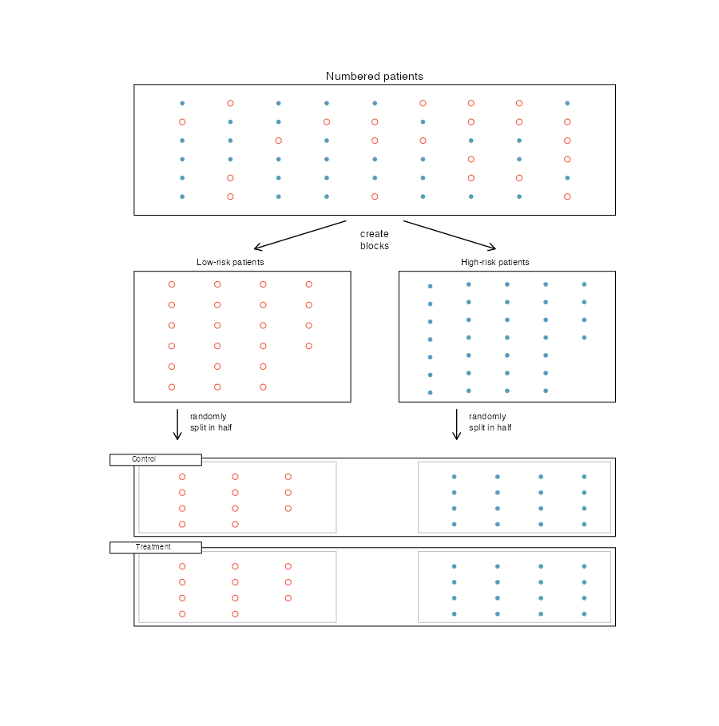
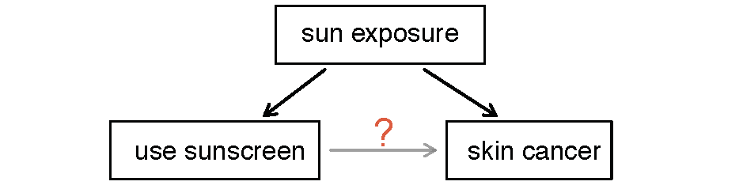

```{r}
#| include: false
#| cache: false
source("../_colors.R")
```


::: {.chapterintro}
Before digging into the details of working with data, we pause to think about how data come to be. If data are to be used to draw broad conclusions, then it is important to understand who or what the data represent. One important aspect is **sampling** --- knowing how the observational units were selected from a larger group allows us to generalize back to the population from which the data were drawn. Additionally, by understanding the structure of the study, we can separate causal relationships from mere associations. A good question to ask before analyzing any dataset is: *How were these observations collected?* You will learn a lot about the data by understanding its source.
:::

::: {.statlens}
**StatLens: Sampling Bias Lab.** Convinced you could pick a "representative" sample by eye? Try the [Sampling Bias Lab](/conceptual/sampling-bias/){target="_blank"}. You hand-pick "representative" words from the Gettysburg Address (the population), then the tool draws random samples of the same size. Both sets of sample means are plotted against the true population mean ($\mu \approx 4.3$ letters). The point of the demo: human-chosen samples are systematically biased, and the bias does **not** shrink as $n$ grows. Random sampling is not just one option --- it is the option that lets sample statistics estimate population parameters honestly.
:::

## Populations and samples {#sec-populations-samples}

The first step in conducting research is to identify the question to be investigated. A clearly stated research question helps identify what subjects or cases should be studied and what variables are important. It is also important to consider *how* data are collected so that they are reliable and help achieve the research goals.

Consider the following three research questions:

1. What is the average mercury content in swordfish in the Atlantic Ocean?
2. Over the last five years, what is the average time to complete a degree for UW--La Crosse undergrads?
3. Does a new drug reduce the number of deaths in patients with severe heart disease?

::: {.definition}
The **population** is the entire group of individuals or cases about which we want information. A **sample** is a subset of the population from which we actually collect data. A **census** is a study that attempts to collect data from every member of the population.
:::

Each research question refers to a target population. In the first question, the target population is all swordfish in the Atlantic Ocean, and each fish represents a case. Oftentimes it is not feasible to collect data for every case in a population. A census is difficult because it may be too expensive, or it might be difficult or impossible to even identify every member of the population. Instead, we take a sample. Ideally, a sample is a manageable fraction of the population. For instance, 60 swordfish might be selected, and this sample data may be used to estimate the population average mercury content.

::: {.guidedpractice}
For the second and third research questions above, identify the target population and what represents an individual case.

<details>
<summary>Show answer</summary>
For the question about time to complete a degree, the population includes all UW--La Crosse undergraduates who graduated in the last five years (we can only compute an average for students who actually finished). Each graduate is an individual case. For the question about the heart disease drug, the population includes all people with severe heart disease, and each person represents a case.
</details>
:::

### Parameters and statistics

In most statistical analyses, the research question boils down to understanding a numerical summary --- perhaps a quantity you already know (like the average) or one you will learn about in this course.

A numerical summary can be calculated on either the sample or the entire population. However, measuring every unit in the population is usually impossible. So we calculate the summary from a sample and use it to estimate the corresponding population value.

::: {.definition}
A **population parameter** is a numerical summary calculated from (or defined for) the entire population. A **sample statistic** is a numerical summary calculated from the sample data.
:::

We use specific terms to distinguish between numbers calculated from a sample (sample statistics) and numbers that describe the entire population (population parameters). These terms will be used extensively in later chapters when we discuss making inferences about populations.

::: {.guidedpractice}
A poll of 1,000 likely voters finds that 54% plan to vote for Candidate A. Identify the population parameter and the sample statistic.

<details>
<summary>Show answer</summary>
The sample statistic is 54% --- this is the proportion observed in the sample of 1,000 voters. The population parameter is the true proportion of *all* likely voters who plan to vote for Candidate A, which is unknown. The sample statistic (54%) is our best estimate of that unknown parameter.
</details>
:::

### Anecdotal evidence

Consider the following possible responses to the three research questions from above:

1. A man on the news got mercury poisoning from eating swordfish, so the average mercury concentration in swordfish must be dangerously high.
2. I met two students who took more than 7 years to graduate from UW--La Crosse, so it must take longer to graduate here than at many other schools.
3. My friend's dad had a heart attack and died after they gave him a new heart disease drug, so the drug must not work.

Each conclusion is based on data. However, there are two problems. First, the data only represent one or two cases. Second, and more importantly, it is unclear whether these cases are actually representative of the population. Data collected in this haphazard fashion are called **anecdotal evidence**.

::: {.important}
**Be careful of anecdotal evidence.** Such evidence may be true and verifiable, but it may only represent extraordinary cases and therefore not be a good representation of the population.
:::

Anecdotal evidence typically consists of unusual cases that we recall based on their striking characteristics. For instance, we are more likely to remember the two people who took 7 years to graduate than the six others who graduated in four years. Instead of focusing on the most unusual cases, we should examine a sample of many cases that better represent the population.

## Sampling from a population {#sec-sampling-from-population}

We might try to estimate the time to graduation for UW--La Crosse undergraduates by collecting a sample of graduates. All graduates in the last five years represent the *population*, and graduates who are selected for review are collectively called the *sample*. In general, we always seek to *randomly* select a sample from a population. The most basic type of random selection is equivalent to how raffles are conducted. For example, we could write each graduate's name on a raffle ticket and draw 10 tickets. The selected names would represent a random sample of 10 graduates.

```{r}
#| label: fig-sampling-from-population
#| fig-cap: "Sampling from a population. Individuals are randomly selected from the population (large circle) to be included in the sample (small circle)."
#| fig-alt: "A large circle contains many dots representing the population. A smaller circle contains a few dots that have been randomly selected from the larger circle, representing the sample."
#| echo: false

set.seed(42)
par(mar = c(0, 0, 0, 0))
plot.new()
plot.window(xlim = c(0, 10), ylim = c(0, 10))

# Population circle
symbols(3.5, 5, circles = 3.2, inches = FALSE, add = TRUE, fg = "gray40", lwd = 2)
text(3.5, 8.7, "Population", cex = 1.3, font = 2)

# Population dots
pop_x <- runif(60, 1, 6)
pop_y <- runif(60, 2.2, 7.8)
keep <- ((pop_x - 3.5)^2 + (pop_y - 5)^2) < 3^2
pop_x <- pop_x[keep]
pop_y <- pop_y[keep]
points(pop_x, pop_y, pch = 16, col = "gray50", cex = 0.9)

# Arrow
arrows(6.2, 5, 7.3, 5, length = 0.15, lwd = 2, col = "gray30")

# Sample circle
symbols(8.5, 5, circles = 1.3, inches = FALSE, add = TRUE, fg = COL_BLUE, lwd = 2)
text(8.5, 6.7, "Sample", cex = 1.3, font = 2, col = COL_BLUE)

# Sample dots
samp_x <- c(8.1, 8.9, 8.3, 8.7, 8.5)
samp_y <- c(5.5, 5.3, 4.5, 4.7, 5.0)
points(samp_x, samp_y, pch = 16, col = COL_BLUE, cex = 1.1)

# Highlight corresponding dots in population
sel <- sample(which(keep), 5)
points(pop_x[1:5], pop_y[1:5], pch = 16, col = COL_BLUE, cex = 1.1)
```

::: {.workedexample}
Suppose we ask a student who happens to be majoring in nutrition to select several graduates for the study. Which students do you think they might pick? Do you think their sample would be representative of all graduates?

---

They might pick a disproportionate number of graduates from health-related fields. When selecting samples by hand, we run the risk of picking a **biased** sample, even if our bias is unintentional.
:::

```{r}
#| label: fig-biased-sample
#| fig-cap: "A biased sample. A nutrition major asked to select graduates might inadvertently pick a disproportionate number from health-related fields."
#| fig-alt: "A large circle contains many dots representing all graduates. Some dots are highlighted to show graduates from health-related fields. The sample in the smaller circle is drawn primarily from this highlighted subset, illustrating bias."
#| echo: false

set.seed(51)
par(mar = c(0, 0, 0, 0))
plot.new()
plot.window(xlim = c(0, 10), ylim = c(0, 10))

# Population circle
symbols(3.5, 5, circles = 3.2, inches = FALSE, add = TRUE, fg = "gray40", lwd = 2)
text(3.5, 8.7, "Population", cex = 1.3, font = 2)

# Population dots — general (gray)
pop_x <- runif(45, 0.8, 6.2)
pop_y <- runif(45, 2.2, 7.8)
keep <- ((pop_x - 3.5)^2 + (pop_y - 5)^2) < 3^2
pop_x <- pop_x[keep]
pop_y <- pop_y[keep]
points(pop_x, pop_y, pch = 16, col = "gray60", cex = 0.9)

# Health-related cluster in upper-right of population circle
hx <- runif(10, 4.5, 6.0)
hy <- runif(10, 5.5, 7.2)
hkeep <- ((hx - 3.5)^2 + (hy - 5)^2) < 3^2
hx <- hx[hkeep]
hy <- hy[hkeep]
points(hx, hy, pch = 16, col = COL_PINK, cex = 1.0)
text(5.2, 7.6, "Health fields", cex = 0.85, col = COL_PINK, font = 3)

# Arrow
arrows(6.2, 5, 7.3, 5, length = 0.15, lwd = 2, col = "gray30")

# Sample circle
symbols(8.5, 5, circles = 1.3, inches = FALSE, add = TRUE, fg = COL_PINK, lwd = 2)
text(8.5, 6.7, "Sample", cex = 1.3, font = 2, col = COL_PINK)

# Sample dots — mostly pink (biased toward health)
samp_x <- c(8.1, 8.9, 8.3, 8.7, 8.5, 8.2)
samp_y <- c(5.5, 5.3, 4.5, 4.8, 5.1, 4.2)
samp_col <- c(COL_PINK, COL_PINK, COL_PINK, COL_PINK, "gray60", COL_PINK)
points(samp_x, samp_y, pch = 16, col = samp_col, cex = 1.1)
```

If someone is permitted to pick and choose exactly which individuals are included in the sample, it is entirely possible that the sample will overrepresent that person's interests --- even if the bias is unintentional. Sampling randomly helps address this problem.

::: {.definition}
A **simple random sample (SRS)** is a sample drawn so that each case in the population has an equal chance of being included, and the selection of any one case is independent of the selection of any other case. This is equivalent to drawing names out of a hat.
:::

The act of taking a simple random sample helps minimize bias. However, bias can crop up in other ways. Even when people are selected at random --- for example, for surveys --- caution must be exercised if the **non-response rate** is high. If only 30% of the people randomly sampled for a survey actually respond, then it is unclear whether the results are **representative** of the entire population. This **non-response bias** can skew results.

```{r}
#| label: fig-non-response-bias
#| fig-cap: "Non-response bias. Survey studies may only reach a certain group within the population. Non-response can make even a random sample unrepresentative."
#| fig-alt: "A large circle contains dots representing the population of interest. Only a subset of dots respond, and these respondents form the sample in the smaller circle, illustrating that non-response can bias the sample."
#| echo: false

set.seed(73)
par(mar = c(0, 0, 0, 0))
plot.new()
plot.window(xlim = c(0, 10), ylim = c(0, 10))

# Population circle
symbols(3.5, 5, circles = 3.2, inches = FALSE, add = TRUE, fg = "gray40", lwd = 2)
text(3.5, 8.7, "Population", cex = 1.3, font = 2)

# Population dots
pop_x <- runif(50, 0.8, 6.2)
pop_y <- runif(50, 2.2, 7.8)
keep <- ((pop_x - 3.5)^2 + (pop_y - 5)^2) < 3^2
pop_x <- pop_x[keep]
pop_y <- pop_y[keep]
n <- length(pop_x)

# Mark some as "selected" (blue outline) but only some respond
selected <- sample(seq_len(n), min(12, n))
responded <- selected[1:min(5, length(selected))]
no_resp <- setdiff(selected, responded)

# Draw all population dots gray
points(pop_x, pop_y, pch = 16, col = "gray60", cex = 0.9)

# Selected but non-responding: blue outline, X through them
points(pop_x[no_resp], pop_y[no_resp], pch = 4, col = COL_RED, cex = 1.4, lwd = 2)
points(pop_x[no_resp], pop_y[no_resp], pch = 1, col = COL_BLUE, cex = 1.2, lwd = 1.5)

# Responded: solid blue
points(pop_x[responded], pop_y[responded], pch = 16, col = COL_BLUE, cex = 1.1)

# Legend
text(3.5, 1.5, "X = selected but did not respond", cex = 0.85, col = COL_RED)

# Arrow
arrows(6.2, 5, 7.3, 5, length = 0.15, lwd = 2, col = "gray30")

# Sample circle
symbols(8.5, 5, circles = 1.3, inches = FALSE, add = TRUE, fg = COL_BLUE, lwd = 2)
text(8.5, 6.7, "Sample", cex = 1.3, font = 2, col = COL_BLUE)
text(8.5, 3.3, "(respondents\nonly)", cex = 0.85, col = COL_BLUE)

# Sample dots — only the responders
samp_x <- seq(8.0, 9.0, length.out = length(responded))
samp_y <- rep(5, length(responded)) + seq(-0.5, 0.5, length.out = length(responded))
points(samp_x, samp_y, pch = 16, col = COL_BLUE, cex = 1.1)
```

Another common problem is a **convenience sample**, where individuals who are easily accessible are more likely to be included. For instance, if a political survey is conducted by stopping people on a single street corner, the results will not represent the broader city. It is often difficult to discern what sub-population a convenience sample actually represents.

::: {.guidedpractice}
We can easily access ratings for products, sellers, and companies on websites like Amazon. These ratings come only from people who go out of their way to provide a rating. If 50% of online reviews for a product are negative, do you think this means that 50% of buyers are dissatisfied with the product? Why or why not?

<details>
<summary>Show answer</summary>
Probably not. People tend to be more motivated to leave a review when they have a negative experience than when a product meets expectations. This creates a negative bias in product ratings --- dissatisfied customers are overrepresented among reviewers. This is a form of non-response bias (satisfied customers are less likely to respond).
</details>
:::

## Sampling methods {#sec-sampling-methods}

Almost all statistical methods are based on the notion of randomness. If data are not collected using a random process from a population, then the estimates and the errors associated with those estimates are not reliable. Here we consider four random sampling techniques: simple random sampling, stratified sampling, cluster sampling, and multistage sampling.

### Simple random sampling

**Simple random sampling** is the most intuitive form of random sampling. Consider the salaries of Major League Baseball (MLB) players, where each player belongs to one of the league's 30 teams. To take a simple random sample of 120 baseball players and their salaries, we could write the names of all players onto slips of paper, drop the slips into a bucket, mix them thoroughly, then draw out 120 slips. In general, a sample is called "simple random" if each case in the population has an equal chance of being included in the final sample *and* knowing that a particular case is included tells us nothing about which other cases are included.

```{r}
#| label: fig-simple-random-sample
#| fig-cap: "Simple random sampling. 18 cases (shown in red) are randomly selected from the population."
#| fig-alt: "A box contains many dots representing the population. 18 dots are highlighted in red, showing they were randomly selected for the sample with no grouping structure."
#| echo: false

set.seed(88)
par(mar = c(0, 0, 0, 0))
plot.new()
plot.window(xlim = c(0, 10), ylim = c(0, 10))

# Outer box
rect(0.5, 0.5, 9.5, 9.5, border = "gray40", lwd = 2)

# Grid of dots
gx <- seq(1.5, 8.5, length.out = 10)
gy <- seq(1.5, 8.5, length.out = 8)
coords <- expand.grid(x = gx, y = gy)
n <- nrow(coords)

# Randomly select 18
sel <- sample(seq_len(n), 18)
col_vec <- rep("gray60", n)
col_vec[sel] <- COL_RED
cex_vec <- rep(1.0, n)
cex_vec[sel] <- 1.3

points(coords$x, coords$y, pch = 16, col = col_vec, cex = cex_vec)
```

### Stratified sampling

**Stratified sampling** is a divide-and-conquer strategy. The population is divided into groups called **strata**. The strata are chosen so that similar cases are grouped together, then a second sampling method (usually simple random sampling) is used within each stratum. In the baseball salary example, each of the 30 teams could represent a stratum, since some teams have much larger payrolls than others. We might randomly sample 4 players from each team to get our sample of 120.

```{r}
#| label: fig-stratified-sample
#| fig-cap: "Stratified sampling. Cases are first grouped into strata, then simple random sampling is used within each stratum to select 3 cases per stratum."
#| fig-alt: "A box contains dots divided into six vertical strata. Within each stratum, three dots are highlighted in red, showing that a random sample is taken from within each group."
#| echo: false

set.seed(101)
par(mar = c(0, 0, 0, 0))
plot.new()
plot.window(xlim = c(0, 10), ylim = c(0, 10))

# Outer box
rect(0.5, 0.5, 9.5, 9.5, border = "gray40", lwd = 2)

# 6 vertical strata
n_strata <- 6
boundaries <- seq(0.5, 9.5, length.out = n_strata + 1)
for (i in 2:n_strata) {
  segments(boundaries[i], 0.5, boundaries[i], 9.5, col = "gray70", lwd = 1, lty = 2)
}

# Dots within each stratum
for (s in seq_len(n_strata)) {
  left <- boundaries[s] + 0.2
  right <- boundaries[s + 1] - 0.2
  cx <- runif(8, left, right)
  cy <- seq(1.5, 8.5, length.out = 8)
  sel <- sample(8, 3)
  col_vec <- rep("gray60", 8)
  col_vec[sel] <- COL_RED
  cex_vec <- rep(1.0, 8)
  cex_vec[sel] <- 1.3
  points(cx, cy, pch = 16, col = col_vec, cex = cex_vec)
}

# Stratum labels
for (s in seq_len(n_strata)) {
  mid <- (boundaries[s] + boundaries[s + 1]) / 2
  text(mid, 9.8, paste("Stratum", s), cex = 0.7, col = "gray40")
}
```

Stratified sampling is especially useful when cases within each stratum are very similar with respect to the outcome of interest.

::: {.workedexample}
Why is it beneficial for cases within each stratum to be very similar?

---

If cases within a stratum are similar, we can get a very stable (precise) estimate for each subgroup. When we combine these stratum-level estimates into a single estimate for the full population, the overall estimate will tend to be more precise because each individual component is itself more precise.
:::

### Cluster sampling

In a **cluster sample**, we break up the population into many groups called **clusters**, then randomly select a fixed number of clusters and include *all* observations from each selected cluster in the sample.

```{r}
#| label: fig-cluster-sample
#| fig-cap: "Cluster sampling. The population is divided into nine clusters. Three clusters are randomly selected, and all observations within those clusters are included in the sample."
#| fig-alt: "A box contains dots divided into nine clusters. Three clusters are highlighted, and every dot within those three clusters is selected for the sample."
#| echo: false

set.seed(55)
par(mar = c(0, 0, 0, 0))
plot.new()
plot.window(xlim = c(0, 10), ylim = c(0, 10))

# Outer box
rect(0.5, 0.5, 9.5, 9.5, border = "gray40", lwd = 2)

# 3x3 grid of clusters
cx <- rep(seq(2, 8, by = 3), 3)
cy <- rep(seq(2, 8, by = 3), each = 3)
selected_clusters <- c(2, 5, 7)  # which clusters are selected

for (k in 1:9) {
  x0 <- cx[k] - 1.2
  x1 <- cx[k] + 1.2
  y0 <- cy[k] - 1.2
  y1 <- cy[k] + 1.2
  is_sel <- k %in% selected_clusters
  rect(x0, y0, x1, y1, border = if (is_sel) COL_RED else "gray70",
       lwd = if (is_sel) 2.5 else 1, lty = if (is_sel) 1 else 2,
       col = if (is_sel) "#F0513320" else NA)
  # Dots inside cluster
  dx <- runif(6, x0 + 0.2, x1 - 0.2)
  dy <- runif(6, y0 + 0.2, y1 - 0.2)
  dot_col <- if (is_sel) COL_RED else "gray60"
  points(dx, dy, pch = 16, col = dot_col, cex = 1.0)
}
```

### Multistage sampling

A **multistage sample** is like a cluster sample, but instead of keeping all observations in each selected cluster, we take a random sample *within* each selected cluster.

```{r}
#| label: fig-multistage-sample
#| fig-cap: "Multistage sampling. Three clusters are randomly selected, then a random sample of observations is drawn from within each selected cluster."
#| fig-alt: "A box contains dots divided into nine clusters. Three clusters are highlighted, and only a random subset of dots within each selected cluster is included in the sample."
#| echo: false

set.seed(55)
par(mar = c(0, 0, 0, 0))
plot.new()
plot.window(xlim = c(0, 10), ylim = c(0, 10))

# Outer box
rect(0.5, 0.5, 9.5, 9.5, border = "gray40", lwd = 2)

# 3x3 grid of clusters
cx <- rep(seq(2, 8, by = 3), 3)
cy <- rep(seq(2, 8, by = 3), each = 3)
selected_clusters <- c(2, 5, 7)

for (k in 1:9) {
  x0 <- cx[k] - 1.2
  x1 <- cx[k] + 1.2
  y0 <- cy[k] - 1.2
  y1 <- cy[k] + 1.2
  is_sel <- k %in% selected_clusters
  rect(x0, y0, x1, y1, border = if (is_sel) COL_RED else "gray70",
       lwd = if (is_sel) 2.5 else 1, lty = if (is_sel) 1 else 2,
       col = if (is_sel) "#F0513320" else NA)
  # Dots inside cluster — use same seed offset per cluster for consistency
  set.seed(55 + k)
  dx <- runif(6, x0 + 0.2, x1 - 0.2)
  dy <- runif(6, y0 + 0.2, y1 - 0.2)
  if (is_sel) {
    # Only some dots are selected (red), others gray
    sub_sel <- sample(6, 3)
    dot_col <- rep("gray60", 6)
    dot_col[sub_sel] <- COL_RED
    dot_cex <- rep(0.9, 6)
    dot_cex[sub_sel] <- 1.3
    points(dx, dy, pch = 16, col = dot_col, cex = dot_cex)
  } else {
    points(dx, dy, pch = 16, col = "gray60", cex = 0.9)
  }
}
```

Cluster and multistage sampling can be more economical than other techniques. Unlike stratified sampling, these approaches work best when there is a lot of case-to-case variability *within* a cluster but the clusters themselves are fairly similar to one another. For example, if neighborhoods represent clusters, then cluster sampling works best when the residents within each neighborhood are diverse.

::: {.workedexample}
Suppose we want to estimate the malaria rate in a densely tropical portion of rural Indonesia. There are 30 villages in the region, each more or less like the next, but the distances between villages are substantial. We want to test 150 individuals for malaria. What sampling method should we use?

---

A simple random sample would likely draw individuals from all 30 villages, making data collection very expensive given the travel distances. Stratified sampling would be difficult because it is unclear how to group individuals into similar strata. However, cluster or multistage sampling are excellent choices. With multistage sampling, we could randomly select, say, 15 of the 30 villages, then randomly select 10 people from each village. This would substantially reduce data collection costs while still yielding reliable information.
:::

::: {.original}
### Comparing the four methods

The table below summarizes the key features of each sampling method:

| Method | How it works | Best used when... |
|:-------|:-------------|:------------------|
| Simple random | Every case has an equal chance of selection | Population is relatively homogeneous and accessible |
| Stratified | Divide into similar groups (strata), then SRS within each | Known subgroups differ on the outcome of interest |
| Cluster | Randomly select entire groups (clusters) | Clusters are internally diverse but similar to each other; travel/cost is a concern |
| Multistage | Randomly select clusters, then SRS within each | Same as cluster, but clusters are large |
:::

## Experiments {#sec-experiments}

::: {.definition}
An **experiment** is a study where the researchers actively assign treatments to cases. When this assignment uses randomization (e.g., a coin flip to decide which treatment a patient receives), it is called a **randomized experiment**. Randomized experiments are fundamentally important when trying to establish a causal connection between two variables.
:::

### Principles of experimental design {#sec-principles-experimental-design}

Well-designed experiments incorporate four key principles:

1. **Controlling.** Researchers assign treatments to cases and do their best to **control** any other differences between the groups. For example, when patients take a drug in pill form, some patients might take the pill with a sip of water while others drink a full glass. To control for the effect of water consumption, a doctor might instruct every patient to drink a 12-ounce glass of water with the pill.

2. **Randomization.** Researchers randomly assign subjects to treatment groups to account for variables that cannot be controlled. For example, some patients may be more susceptible to a disease than others due to their dietary habits. Randomly assigning patients to treatment or control groups helps even out such differences across groups.

3. **Replication.** The more cases researchers observe, the more accurately they can estimate the effect of the explanatory variable on the response. In a single study, we **replicate** by collecting a sufficiently large sample. At a minimum, we want multiple subjects per treatment group. Replication also refers to repeating an entire study to verify earlier findings. (The **replication crisis** refers to the ongoing problem in several scientific disciplines where past findings have failed to be replicated in new studies.)

4. **Blocking.** Researchers sometimes know or suspect that variables other than the treatment influence the response. They may first group individuals based on this variable into **blocks** and then randomize cases within each block to the treatment groups. For instance, in studying the effect of a drug on heart attacks, researchers might first split patients into low-risk and high-risk blocks, then randomly assign half the patients from each block to the treatment and half to the control group.

{fig-alt="Patients are split into two groups: low-risk and high-risk. Within each group, half are randomly assigned to treatment and half to control, ensuring equal representation of risk levels in both treatment groups."}

It is important to incorporate at least the first three principles into any study. Blocking is a slightly more advanced technique that adds precision when relevant grouping variables are known.

**Matched pairs** are a common special case of blocking where each block has exactly two units. The most familiar version uses the *same subject* measured twice — a before/after design, or a crossover where each participant receives both treatments in random order. A different form pairs *distinct* subjects who match on a relevant variable (twins, littermates, students matched on baseline test score) and then randomizes the two treatments within each pair. A typical example: participants complete a mental-rotation test, get an hour of instruction, then take a parallel post-test — each person's *change* score isolates the effect of instruction from their individual baseline ability. In both forms the pair acts as its own control, absorbing subject-to-subject variability that would otherwise inflate the standard error. We revisit matched-pairs data — and the paired analysis it enables — in the [confidence intervals for means chapter](ci-for-means.qmd) and the [hypothesis tests for means chapter](hypothesis-tests-means.qmd).

### Reducing bias in human experiments {#sec-reducing-bias}

Randomized experiments are considered the gold standard for establishing cause-and-effect, but they do not automatically eliminate all bias. Human studies are a perfect example of where bias can unintentionally arise.

Consider a study where a new drug is tested to see if it reduces deaths in heart attack patients. Researchers designed a randomized experiment: study volunteers were randomly placed into two groups. The **treatment group** received the drug. The **control group** did not receive any drug treatment.

Put yourself in the place of a person in the study. If you are in the treatment group, you receive a promising new drug and may feel hopeful. A person in the control group receives nothing and might feel anxious. These emotional effects could influence health outcomes independently of the drug itself. This means there are actually two effects at play: the drug's real effectiveness, and the emotional impact of knowing (or not knowing) that you are receiving treatment.

::: {.definition}
A study is **blind** (or **single-blind**) if the patients do not know which treatment group they are in. A **placebo** is a fake treatment (such as a sugar pill) given to the control group so that patients cannot tell whether they are receiving the real treatment. The **placebo effect** is the phenomenon where patients show improvement simply because they believe they are receiving treatment. A study is **double-blind** if neither the patients nor the doctors and researchers interacting with them know who is receiving which treatment.
:::

To prevent emotional effects from biasing the study, researchers want patients to be unaware of their group assignment --- that is, the study should be *blind*. But if a patient in the control group receives nothing at all, they will know they are not getting treated. The solution is a placebo. An effective placebo is the key to making a study truly blind.

The patients are not the only ones who should be blinded. Doctors and researchers can also unintentionally bias a study. A doctor who knows a patient is receiving the real treatment might give that patient more attention or care. To guard against this, most modern studies use a **double-blind** setup.

::: {.guidedpractice}
Think back to the stent study described in @sec-case-stents. Is it an experiment? Was the study blinded? Was it double-blinded?

<details>
<summary>Show answer</summary>
The researchers assigned patients to treatment groups, so it is an experiment. However, patients could distinguish what treatment they received because a stent is a surgical procedure. There is no simple equivalent of a "placebo stent" (though sham surgeries do exist), so the study was likely not fully blinded. If the study was not blind, it could not be double-blind either.
</details>
:::

::: {.guidedpractice}
For the stent study, could the researchers have employed a placebo? If so, what would it have looked like?

<details>
<summary>Show answer</summary>
In principle, researchers could use a **sham surgery** --- the patient undergoes a surgical procedure but does not actually receive the stent. Sham surgeries do exist in medical research, but they raise serious ethical questions because they expose control-group patients to the risks of surgery without the potential benefit of the treatment.
</details>
:::

There are always multiple viewpoints on experiments and placebos, and rarely is it obvious which approach is ethically "correct." Is it ethical to use a sham surgery that creates risk for the patient? On the other hand, if we do not use one, we might promote a costly treatment that has no real effect, diverting resources from treatments that actually work.

## Observational studies {#sec-observational-studies}

::: {.definition}
An **observational study** is a study where no treatment has been explicitly applied or withheld by the researchers. The researchers simply observe and record what happens naturally.
:::

Making causal conclusions based on experiments is often reasonable because researchers can randomly assign treatments. However, making causal conclusions from observational data is much more dangerous and is generally not recommended. Observational studies are typically only sufficient to show **associations** or to form hypotheses that can later be tested with experiments.

::: {.workedexample}
Suppose an observational study tracked sunscreen use and skin cancer, and found that people who used more sunscreen were *more* likely to have skin cancer. Does this mean sunscreen causes skin cancer?

---

No! Previous research tells us that sunscreen actually *reduces* skin cancer risk. The missing piece is **sun exposure**. People who spend a lot of time in the sun are more likely to use sunscreen *and* more likely to get skin cancer. Sun exposure is a **confounding variable** --- it is associated with both sunscreen use and skin cancer, creating a misleading association between the two.
:::

{fig-alt="Three boxes arranged in a triangle: sun exposure at the top, sunscreen use at bottom-left, and skin cancer at bottom-right. Solid arrows point from sun exposure to both sunscreen use and skin cancer. A dashed arrow with a question mark connects sunscreen use to skin cancer, indicating the direct relationship is unclear."}

## Confounding variables {#sec-confounding}

::: {.definition}
A **confounding variable** is a variable that is associated with *both* the explanatory variable and the response variable. Because of this dual association, a confounding variable makes it impossible to determine whether the explanatory variable truly caused the observed response.
:::

::: {.important}
Confounding variables may or may not be measured as part of the study. Regardless, drawing cause-and-effect conclusions from observational studies is difficult because of the ever-present possibility of confounding.
:::

Consider a classic example: ice cream sales and drowning rates both increase during summer months. If we looked only at the association between ice cream sales and drownings, we might (absurdly) conclude that ice cream causes drowning. The confounding variable is **temperature** (or season) --- warm weather drives both increased ice cream consumption and increased swimming, which leads to more drowning incidents.

::: {.guidedpractice}
Suppose data show a negative association between homeownership rates and the percentage of housing units that are in multi-unit structures across U.S. counties. Is it reasonable to conclude that building more apartments *causes* homeownership rates to drop? Suggest a confounding variable.

<details>
<summary>Show answer</summary>
No, a causal conclusion is not warranted from observational data. A likely confounding variable is **population density**. Dense urban counties tend to have more multi-unit housing (apartments, condos) because of limited space, and they also tend to have lower homeownership rates because property values are higher. Population density is associated with both variables.
</details>
:::

### Prospective and retrospective studies

Observational studies come in two forms:

- A **prospective study** identifies individuals and collects information as events unfold going forward. For example, medical researchers might identify and follow a group of patients over many years to assess the influence of behavior on cancer risk. The famous Nurses' Health Study, which started in 1976 and has collected data on over 275,000 nurses, is a prospective study.

- A **retrospective study** collects data after events have already taken place --- for example, by reviewing past medical records.

Some studies contain both prospective and retrospective elements. For instance, a medical study might gather information about participants' histories (retrospective) and then follow them forward in time (prospective).

## Random assignment and causation {#sec-random-assignment-causation}

The distinction between random *sampling* and random *assignment* is crucial. They serve different purposes and affect what conclusions we can draw.

- **Random sampling** (selecting subjects randomly from a population) allows us to **generalize** our findings to the broader population.
- **Random assignment** (randomly assigning subjects to treatment groups in an experiment) allows us to draw **causal** conclusions.

::: {.important}
Random sampling and random assignment are independent concepts. A study can have one, both, or neither. The type of randomization determines the scope of conclusions we can draw.
:::

::: {.workedexample}
A company wants to know whether a new keyboard layout increases typing speed. They recruit 40 volunteers from their office, randomly assign 20 to train on the new layout and 20 to continue with the standard layout, then measure typing speed after one month.

Can the company conclude that the new layout *causes* faster typing? Can they generalize the results to all office workers?

---

Because the study used **random assignment** to treatment groups, the company can make a causal conclusion: any observed difference in typing speed can be attributed to the keyboard layout rather than to pre-existing differences between the groups. However, the 40 volunteers were not randomly selected from all office workers --- they are a convenience sample of volunteers from one company. Therefore, the results may not generalize to all office workers.
:::

## Scope of inference {#sec-scope-of-inference}

The scope of inference --- what conclusions we can draw from a study --- depends on how data were collected. The following table summarizes the four possible scenarios:

::: {.important}

|  | **Random assignment** (to treatments) | **No random assignment** |
|:---|:---|:---|
| **Random sampling** (from population) | Can generalize to the population **and** can draw causal conclusions | Can generalize to the population, but **cannot** draw causal conclusions |
| **No random sampling** | **Cannot** generalize to the population, but can draw causal conclusions (for subjects like those in the study) | **Cannot** generalize **and cannot** draw causal conclusions |

:::

```{r}
#| label: fig-scope-of-inference
#| fig-cap: "Scope of inference. The type of sampling determines whether results generalize to the population; the type of assignment determines whether causal conclusions are possible."
#| fig-alt: "A two-by-two table. Rows are labeled random sample (yes/no) and columns are labeled random assignment (yes/no). The top-left cell says generalize and causation. The top-right cell says generalize only. The bottom-left cell says causation only. The bottom-right cell says association only."
#| echo: false

par(mar = c(0, 0, 0, 0))
plot.new()
plot.window(xlim = c(0, 10), ylim = c(0, 10))

# Column headers
text(5.5, 9.5, "Random Assignment", cex = 1.3, font = 2)
text(4, 8.7, "Yes", cex = 1.1, font = 2, col = COL_BLUE)
text(7, 8.7, "No", cex = 1.1, font = 2, col = "gray50")

# Row headers
text(1.2, 7.8, "Random\nSampling", cex = 1.1, font = 2, srt = 0)
text(2.3, 6.5, "Yes", cex = 1.1, font = 2, col = COL_BLUE)
text(2.3, 3.5, "No", cex = 1.1, font = 2, col = "gray50")

# Grid lines
rect(3, 1.5, 5.5, 5, border = "gray40", lwd = 1.5)
rect(5.5, 1.5, 8, 5, border = "gray40", lwd = 1.5)
rect(3, 5, 5.5, 8, border = "gray40", lwd = 1.5)
rect(5.5, 5, 8, 8, border = "gray40", lwd = 1.5)

# Cell contents
# Top-left: generalize + causation
text(4.25, 6.8, "Generalize", cex = 1.0, font = 2, col = COL_BLUE)
text(4.25, 6.2, "&", cex = 0.9, col = "gray40")
text(4.25, 5.6, "Causation", cex = 1.0, font = 2, col = COL_BLUE)

# Top-right: generalize only
text(6.75, 6.8, "Generalize", cex = 1.0, font = 2, col = COL_BLUE)
text(6.75, 6.0, "only", cex = 0.9, col = "gray50")

# Bottom-left: causation only
text(4.25, 3.8, "Causation", cex = 1.0, font = 2, col = COL_BLUE)
text(4.25, 3.0, "only", cex = 0.9, col = "gray50")

# Bottom-right: association only
text(6.75, 3.8, "Association", cex = 1.0, font = 2, col = "gray50")
text(6.75, 3.0, "only", cex = 0.9, col = "gray50")
```

Very few studies achieve both random sampling *and* random assignment. In practice, experiments typically use volunteers (not random samples from the population), so they fall in the bottom-left cell: they can establish causation, but the results may not generalize beyond the type of people who volunteered. Observational studies based on random samples (top-right cell) can generalize to the population but cannot establish cause-and-effect.

::: {.guidedpractice}
A researcher randomly selects 500 adults from a city's voter rolls and surveys them about exercise habits and depression symptoms. She finds that people who exercise more report fewer depression symptoms. What conclusions can she draw?

<details>
<summary>Show answer</summary>
Because the researcher used **random sampling** (from the voter rolls), she can generalize her findings to the city's adult voter population. However, because she did not randomly **assign** people to exercise or not exercise (this is an observational study), she cannot conclude that exercise *causes* fewer depression symptoms. There may be confounding variables --- for example, people with fewer depression symptoms may be more motivated to exercise in the first place.
</details>
:::

::: {.guidedpractice}
A pharmaceutical company recruits 200 volunteers with chronic pain and randomly assigns half to receive a new pain medication and half to receive a placebo. The group receiving the medication reports substantially less pain. What is the scope of inference?

<details>
<summary>Show answer</summary>
Because the study used **random assignment**, the company can conclude that the medication *caused* the reduction in pain (a causal conclusion). However, because the participants were volunteers rather than a random sample of all chronic pain patients, the results may not generalize to the entire population of chronic pain sufferers --- only to people similar to those who volunteered.
</details>
:::

## Chapter review {#sec-study-design-review}

### Summary

In this chapter, we explored how data are collected and why the method of collection matters for the conclusions we can draw.

**Key concepts:**

- The **population** is the entire group of interest; a **sample** is a subset from which we collect data. A **census** collects data on every member of the population but is usually impractical.
- **Anecdotal evidence** --- conclusions drawn from one or a few non-representative cases --- is unreliable.
- **Sampling methods** include simple random sampling, stratified sampling, cluster sampling, and multistage sampling. Each has advantages depending on the population's structure and practical constraints.
- **Bias** can enter through non-random sampling (selection bias), non-response, or convenience sampling.
- In an **experiment**, researchers actively assign treatments to subjects. In an **observational study**, researchers simply observe without intervening.
- **Random assignment** to treatment groups is the key to establishing **causation**.
- **Confounding variables** are associated with both the explanatory and response variables and can create misleading associations.
- **Blinding** (single and double) and **placebos** help reduce bias in human experiments.
- The **scope of inference** depends on whether the study used random sampling (which enables generalization) and random assignment (which enables causal conclusions).

### Key terms

| Term | Definition |
|:-----|:-----------|
| Population | The entire group of individuals about which we want information |
| Sample | A subset of the population from which we collect data |
| Census | An attempt to collect data from every member of the population |
| Population parameter | A numerical summary of the entire population |
| Sample statistic | A numerical summary calculated from sample data |
| Anecdotal evidence | Data collected in a haphazard fashion, often representing unusual cases |
| Simple random sample (SRS) | A sample where every case has an equal chance of selection, independently |
| Stratified sampling | Dividing the population into strata, then taking an SRS within each |
| Cluster sampling | Randomly selecting entire clusters and including all cases within them |
| Multistage sampling | Randomly selecting clusters, then taking an SRS within each selected cluster |
| Bias | Systematic favoritism in data collection that makes a sample unrepresentative |
| Non-response bias | Bias introduced when sampled individuals do not respond |
| Convenience sample | A sample where easily accessible individuals are overrepresented |
| Experiment | A study where the researchers assign treatments to subjects |
| Randomized experiment | An experiment where treatments are assigned using randomization |
| Observational study | A study where researchers observe without assigning treatments |
| Confounding variable | A variable associated with both the explanatory and response variables |
| Treatment group | The group receiving the experimental treatment |
| Control group | The group not receiving the treatment (or receiving a placebo) |
| Placebo | A fake treatment given to the control group |
| Placebo effect | Improvement in patients who believe they are receiving treatment |
| Blind (single-blind) | Subjects do not know their treatment assignment |
| Double-blind | Neither subjects nor researchers know the treatment assignments |
| Blocking | Grouping subjects by a known variable before random assignment |
| Prospective study | An observational study that follows subjects forward in time |
| Retrospective study | An observational study that looks back at past data |
| Scope of inference | The extent to which study results can be generalized and/or support causal claims |

## Exercises {.exercises}

Answers to odd-numbered exercises are provided in the [Exercise Solutions appendix](../appendices/exercise-solutions.qmd#sec-solutions-study-design) at the back of the book.


